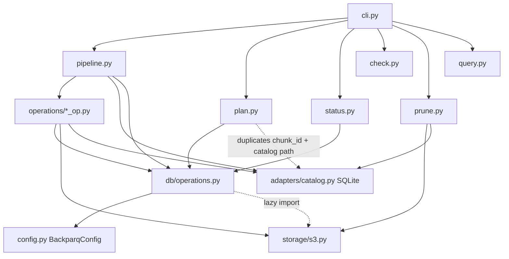

# Backparq — Codebase Review (2026-09-23)

Branch reviewed: `planning/v5` @ `54ba8cb`. Reviewer stance: staff engineer who has to own this.

**Bottom line:** the v2 layered design (catalog, state machine, operations) is a real step forward, and the core idea is sound. But in its most dangerous mode (`offload` + `perform_delete`, plus `prune`) the tool **can permanently destroy the only copy of data** through at least three independent paths. In `backup` mode it **silently stops taking backups after the first run**. Do not run offload-with-delete or prune against production data until the red flags below are fixed.

---

## 1. Assumptions & coverage

The Context fields were left unfilled, so I inferred them:

| Field | Inferred value | Basis |
|---|---|---|
| What it does | CLI that exports Postgres tables in time chunks to Parquet (via DuckDB `postgres_scan`), uploads to S3, optionally deletes the source rows ("offload"), and restores from S3 | `pipeline.py`, `README.md` |
| Callers | Humans and cron / K8s CronJob (the README "Scheduling" section and the "Serverless Friendly" claim) | README |
| Stage & scale | Pre-1.0 OSS package (v0.4.0, "Development Status :: 4 - Beta"), published to PyPI; no issues filed; 18 commits | `pyproject.toml`, git log, GitHub issues (0) |
| Language/platform | Python ≥3.8 as declared (really ≥3.9 — see scorecard, Change safety); psycopg3, DuckDB, pyarrow, boto3, SQLite catalog. **Confidence: high** | `pyproject.toml`, imports |
| Team | Single maintainer, large "big bang" commits (latest refactor touched 41 files) | git log |
| Known pain | `docs/architecture_discussion_2026-02-15.md` (a prior review, 5/10) | repo |
| What matters most (assumed) | Data integrity of offload/delete; restore actually working; correctness of backup mode | the product's purpose |

**Coverage:** I read every file under `src/backparq/` (≈4.8k LOC, 100%), `README.md`, `CHANGELOG.md`, the examples' retention/cutoff sections, the architecture doc, and the CI workflow. I ran the test suite. I also ran DuckDB 1.5.5 and pyarrow 25.0.1 experiments to confirm timestamp-cast and encryption-API behaviour.

**Blind spots:** no live Postgres or S3 was run (testcontainers were not used), so behaviour of `postgres_scan` filter pushdown and the real lock interaction is inferred from documented semantics. `tests/` was read only enough to see what it imports.

## 2. Purpose statement

**As implemented:** *"Export each configured table in month (or adaptively split) time chunks to Parquet, upload once per chunk identity to S3, optionally delete the exported rows, and track all of this in a SQLite file on the local disk of whichever machine ran it."*

**Gaps against the stated purpose:**
- README: "Take nightly snapshots." Code: each chunk is exported **once, ever** (F-02).
- README: "Restore exactly the tables and rows you need." Code: restores **whole chunk files for every configured table**. There is no `--tables` flag (the README example fails in argparse), and restore depends on a local SQLite file (F-05).
- README: "SHA256 checksums are verified for every single file before any data is deleted." Code: compares an S3 **metadata header that the uploader wrote itself** (F-08).
- Examples: "retention deletes OLD SNAPSHOT RUNS (by run_id date)." Code: deletes by the **data's** month (F-01).

## 3. Flow map

| # | Flow | Trigger / entry | Criticality | Traced? |
|---|---|---|---|---|
| A | Archive, offload + delete | `backparq archive` → `cli.py:59` → `pipeline.archive_tables` | **Critical** (deletes prod rows) | Yes |
| B | Archive, backup mode | same entry, `mode: backup` | High | Yes |
| C | Prune | `backparq prune` → `prune.py:38` | **Critical** (deletes S3 objects) | Yes |
| D | Restore | `backparq restore` → `cli.py:95` → `pipeline.restore_tables` | High | Yes |
| E | Verify / repair | `backparq verify` → `pipeline.verify_archives` | Medium | Yes |
| F | Resume | `backparq resume` = alias of archive (`--run-id` ignored) | Medium | Yes (via A) |
| G | Plan / status / check / history / query | read-only commands | Low | Partially (for consistency with A) |
| H | init / validate / test | setup | Low | Skipped |

### Traced sequence: Flow A (offload + delete)

1. `run_tests`: build encryption, `SELECT 1`, S3 `head_bucket`.
2. Compute a single `cutoff` for all tables (`pipeline.py:78`).
3. Take a pooled coordinator connection and acquire `pg_try_advisory_lock(crc32("backparq_archive_lock"))`.
4. Validate that the tables exist, then compute `watermark = max(pk) WHERE order_by < cutoff` per table. Both run **inside a transaction that stays open for the whole run** (F-06).
5. Open the local SQLite catalog, `start_run`, and send the "started" notification.
6. Per table (thread pool if `concurrency>1`): `list_chunks` does a month walk and recursive `count(*)` bisection until ≤`chunk_rows` (on by default: 500k).
7. Per chunk:
   1. **Export**: skip if the catalog state ≥ EXPORTED. Otherwise DuckDB `COPY (SELECT … FROM postgres_scan(...) WHERE ts >= 'start'::TIMESTAMP AND ts < 'end'::TIMESTAMP AND pk <= wm) TO file`, then sha256, sidecar files, and catalog → EXPORTED (stores `watermark_id`).
   2. **Upload**: `s3.upload_file` with `Metadata.sha256`, then `head_object` and compare metadata. Catalog → UPLOADED.
   3. **Delete**: "verify" (metadata compare), then `DELETE … WHERE ts >= start AND ts < end AND pk <= wm` in ctid batches, committing each batch. Catalog → OFFLOADED. **No comparison of deleted count with exported count.**
8. Release the lock, `finish_run` COMPLETED or FAILED, send the notification, and exit 0 or 2.

**If it dies at each step:**
- After 7.1: the file is local and the catalog says EXPORTED. The next run resumes with the stored watermark. Good.
- After 7.2: S3 holds the file and the catalog says UPLOADED. The next run deletes. Good.
- Mid-7.3: some batches are committed but the catalog still says UPLOADED. The next run re-deletes the same predicate, which is idempotent. Good.
- Rows **updated** between 7.1 and 7.3 are deleted with their new values never archived (F-09).
- If the local disk or catalog is lost: see F-05.

### Flow B (backup)

Same as A with no delete and `cutoff = now`. The second and later runs skip every chunk whose start timestamp is unchanged (F-02).

### Flow C (prune)

1. List every object under `{prefix}/`, covering **both `archive/` and `backups/`**.
2. Parse `year=/month=` from the key.
3. Delete the object if that month is older than `now - retention`.
4. Mark the chunk PRUNED in the catalog if one exists.

### Flow D (restore)

1. Read the **local** catalog.
2. Select chunks with `start ≤ chunk.start < end` in state UPLOADED or OFFLOADED.
3. Per chunk: download, sha256-compare against the catalog, `pq.read_table` (whole file), stage in a temp table, `INSERT … ON CONFLICT`, one commit.
4. `dry_run` and `backup_id` are **never consulted** (F-03), and the CLI exit code ignores the result (F-11).

---

## 4. Red flags (never truncated; ordered by expected damage)

### F-01 · `prune` deletes by the *data's* month, not backup age, across offload archives too, destroying the only copy of offloaded data
Flow / area:   C, steps 1–3
Evidence:      `src/backparq/prune.py:60`, `:83`, `:86`
```
    prefix = f"{config.s3.prefix}/"
            year, month = _parse_year_month(key)
                if file_date < cutoff:
```
Failure:       With `examples/offload.yaml` settings (`mode: offload`, `cutoff: "-90d"`, `retention.days: 365`) and `perform_delete: true`, every offloaded month older than 365 days is deleted from S3 on the next `backparq prune`. Those rows were already deleted from Postgres, so the data is gone. In backup mode with `days: 30` (`examples/backup.yaml`), a snapshot of 2023 data taken **today** is pruned immediately, because the key contains `year=2023`. That directly contradicts the example's comment "deletes OLD SNAPSHOT RUNS (by run_id date)".
Blast radius:  Permanent loss of all archived history older than N days. Also silent: the output says "Deleted N files".
Confidence:    confirmed by reading
Fix:           (1) Never prune `archive/` keys unless the user explicitly opts in with a separate `archive_retention` setting. (2) For `backups/`, prune by run date, parsed from `run_id` or `LastModified`, and always keep the newest K runs. (3) Refuse to prune when the catalog says a chunk is OFFLOADED and no other copy exists. (effort: hours to days)

### F-02 · Chunk identity is `table + start` only, so backup mode takes one backup ever, and the last partial month in offload mode is stranded forever
Flow / area:   B and A, step 7.1
Evidence:      `src/backparq/primitives/chunking.py:103`; `src/backparq/operations/export_op.py:60`
```
    return f"{chunk.table}_{chunk.start.strftime('%Y%m%d%H%M%S')}"
    if current_state and current_state >= ChunkState.EXPORTED:
```
Failure:
- **Backup mode:** run 1 on day 1 creates chunks `[Mar 1, now)` etc. and marks them UPLOADED. Run 2 on day 2 produces the same starts, so every chunk is skipped: 0 rows exported, "Archive completed successfully", exit 0. Rows written after run 1 in any non-split month are never backed up. The only exception is months that the adaptive bisection happens to split at a different midpoint, and those produce overlapping or gapped files instead.
- **Offload mode:** run 1 with cutoff Mar 10 offloads `[Mar 1, Mar 10)` as `t_20240301000000` = OFFLOADED. Run 2 finds `min(created_at)` = Mar 10, `month_floor` gives Mar 1, and the chunk `[Mar 1, Apr 1)` gets the same ID, so it is skipped. Rows from Mar 10 to Mar 31 are never archived or deleted, and nothing reports it. The table is stuck at that month permanently, as long as the month holds ≤500k rows.
Blast radius:  Backup mode is useless after day 1, and silently so, which is the worst failure mode for a backup tool. Offload stops making progress.
Confidence:    confirmed by reading (no other guard exists: `overwrite` is only read by `plan.py`)
Fix:           Make chunk identity `(table, start, end, run_id-for-backup)`. In backup mode, scope catalog state per run (the `runs` table already exists). In offload mode, key on `(start, end)` and treat a stored chunk whose `end` is before the new `end` as partial. Add a two-run integration test. (effort: days)

### F-03 · `restore --dry-run` writes to the database
Flow / area:   D
Evidence:      `src/backparq/pipeline.py:455` (param), `:471` (only use: printed)
```
    dry_run: bool = False,
    console.print(f"Dry Run: {'yes' if dry_run else 'no'}")
```
Failure:       An operator runs `backparq restore --start … --end … --conflict-mode upsert --dry-run` to preview. Every matching chunk is inserted, and upsert **overwrites current production rows** with archived values.
Blast radius:  Production data overwritten by an action the operator believed was read-only.
Confidence:    confirmed by reading (grep: no other `dry_run` reference in restore)
Fix:           Short-circuit before `restore_chunk` and print the chunk list with row counts. Add a test asserting no DB writes. (effort: hours)

### F-04 · Export and delete interpret chunk boundaries in different time zones, so rows at every chunk boundary are deleted without ever being exported
Flow / area:   A, steps 7.1 vs 7.3
Evidence:      `src/backparq/db/operations.py:310-311`
```
        f"\"{order_by}\" >= '{start.isoformat()}'::TIMESTAMP",
        f"\"{order_by}\" < '{end.isoformat()}'::TIMESTAMP",
```
Mechanism:
- Casting `'…+00:00'` to `TIMESTAMP` drops the offset.
- Comparing it with a `timestamptz` column (what `postgres_scan` returns for PG `timestamptz`) converts it using **DuckDB's session TimeZone**, which defaults to the host's local zone.
- Verified on DuckDB 1.5.5 with `SET TimeZone='Europe/Berlin'`: `TIMESTAMPTZ '2023-12-31 23:30+00' >= '2024-01-01T00:00:00+00:00'::TIMESTAMP` → **true**.
- The delete side (psycopg, tz-aware params) uses exact UTC.

Failure:       On a UTC+1 host running sequentially: the Dec chunk exports `[Nov 30 23:00Z, Dec 31 23:00Z)` and deletes `[Dec 1 00:00Z, Jan 1 00:00Z)`. The rows from Dec 31 23:00 to 24:00Z are deleted by the Dec delete before the Jan export runs, so they appear in no file. The mirror case, a `timestamp` (no tz) column with a non-UTC PG session `TimeZone`, has the same issue.
Blast radius:  UTC-offset hours of rows lost per chunk boundary (plus every adaptive split boundary), on any non-UTC host. Silent: the pre-delete "verification" doesn't compare counts.
Confidence:    DuckDB semantics confirmed by experiment. End-to-end loss is plausible and needs runtime verification with a non-UTC host against real Postgres.
Fix:           Pass boundaries as explicit UTC `TIMESTAMPTZ` literals and `SET TimeZone='UTC'` on the DuckDB connection. **Independently**, make delete reconcile: delete inside one transaction and abort if `deleted != catalog.row_count` (see F-09). (effort: hours)

### F-05 · The catalog, the only index restore uses, lives on local disk, defaults to `cwd`, and is never backed up
Flow / area:   D step 1, A step 5
Evidence:      `src/backparq/config.py:16`; `src/backparq/pipeline.py:485`
```
DEFAULT_BASE_DIR = Path.cwd() / "backparq-data"
                all_chunks = catalog.list_chunks(table_name=table)
```
Failure:       The README recommends K8s CronJob and Lambda. In those environments the catalog is ephemeral:
- **Restore finds nothing** ("No chunks found to restore") even though every file is in S3.
- In backup mode each run starts empty, which accidentally makes F-02 disappear there.
- A cron job with `cwd=/` writes to `/backparq-data`.
Losing the laptop or VM that ran offload means losing the ability to restore with the tool.
Blast radius:  The restore path, the reason the product exists, depends on a file nobody is told to protect.
Confidence:    confirmed by reading
Fix:           Upload the catalog, or better a per-chunk manifest (the uploader already has all the metadata), to S3 after each state transition. Make restore able to rebuild from an S3 listing. First step: `restore` falls back to listing `{prefix}/archive/{table}/` and reading object metadata. (effort: days)

### F-06 · The coordinator holds an open transaction with `AccessShareLock` on every archived table for the entire run
Flow / area:   A step 4
Evidence:      `src/backparq/pipeline.py:88` (`with pool.connection() as coord_conn:` commits only on exit, `db/connection.py`); `db/operations.py:114`
```
    query = sql.SQL("SELECT max({pk}) FROM {table} WHERE {col} < %s").format(
```
Failure:       A multi-hour offload keeps the coordinator "idle in transaction", holding AccessShareLock on each table.
- An app migration (`ALTER TABLE events ADD COLUMN …`) waits for that lock, and every subsequent app query on `events` queues behind the ALTER. That is a production outage until the archive finishes.
- With `offload_strategy: detach`, `DETACH PARTITION` (ACCESS EXCLUSIVE on the parent) blocks on the tool's own coordinator, so the run **hangs forever** because there is no `lock_timeout`.
Blast radius:  Outage of the source database's write path during migrations. Hung cron jobs.
Confidence:    confirmed by reading; lock semantics per PG docs
Fix:           Put the lock connection in `autocommit` (session advisory locks don't need a transaction), or commit right after computing watermarks. Set `lock_timeout` and `idle_in_transaction_session_timeout` on tool connections. (effort: hours)

### F-07 · `offload_strategy: detach` drops whole partitions that merely *overlap* the chunk
Flow / area:   A step 7.3 (detach branch)
Evidence:      `src/backparq/db/operations.py:518`, `:525-526`
```
    if offload_strategy == "detach":
                detach_and_drop_partition(conn, table, part)
            return 0  # Rows are dropped with the partition, count unknown
```
Failure:       With yearly partitions and monthly chunks, the first chunk (January) finds the 2024 partition "has data in range" and runs `DROP TABLE` on it, destroying February through December before they are exported. Partitions extending past the cutoff lose post-cutoff rows too. It also reports 0 rows deleted. It is currently masked by F-06 (it hangs first); fixing F-06 alone **arms** this bug.
Blast radius:  Loss of up to an entire partition per chunk.
Confidence:    confirmed by reading (reachable: `offload_strategy` is parsed from config at `config.py:473`)
Fix:           Only detach partitions whose bounds (`pg_get_expr(relpartbound)`) lie entirely within already-exported chunks. Otherwise fall back to `delete`. Or remove the option until it is correct. (effort: days, or hours to remove)

### F-08 · "SHA256 verified on S3" compares a metadata string the uploader wrote, not the object's content
Flow / area:   A steps 7.2 and 7.3
Evidence:      `src/backparq/storage/s3.py:100`; `src/backparq/db/operations.py:507`
```
        actual = head.get("Metadata", {}).get("sha256", "")
    if not s3_verify_object_sha256(s3_client, s3_bucket, s3_key, expected_sha256):
```
Failure:       The "verification" is tautological: `put(metadata=X)` followed by `head() == X`. It proves the object exists, not that its bytes match. The real integrity comes from boto3/S3 transport checksums, which is fine, but the safety claim in the README is false. More important, **there is no row-count reconciliation anywhere**: the export count is never compared with a PG count, and the delete count is never compared with the export count.
Blast radius:  The advertised safety net under F-04 and F-09 does not exist.
Confidence:    confirmed by reading
Fix:           Upload with `ChecksumAlgorithm='SHA256'` and verify `ChecksumSHA256` from `head_object(ChecksumMode='ENABLED')`, or GET and hash for small files. Add the count reconciliation from F-04/F-09. Correct the README. (effort: hours)

### F-09 · Rows updated between export and delete are deleted with the updates unarchived
Flow / area:   A, between 7.1 and 7.3
Evidence:      `src/backparq/operations/delete_op.py:84-113` (watermark only; no content or count check). The delete predicate is `ts in range AND pk <= wm`.
Failure:       A row `id=5, created_at=Jan` is exported, then an app `UPDATE`s it (for example status → refunded), then the delete removes it. The archive holds the stale version. The watermark only protects against *inserts*. After a crash between upload and delete, the window can be days long, because resume uses the stored watermark.
Blast radius:  Silent loss of late updates to "cold" rows, which is common with status or refund columns.
Confidence:    confirmed by reading
Fix:           Delete in one transaction and compare `deleted == row_count` (catches deletes and inserts). For updates, document that archived tables must be append-only, or compare `max(updated_at)` / `xmin` against the export snapshot, or export and delete within the same snapshot using DuckDB `pg_use_snapshot` / exported snapshot. (effort: days)

### F-10 · Failures are swallowed: parallel-table errors, delete-verification failures, and SIGTERM all end as "COMPLETED", exit 0
Flow / area:   A step 8
Evidence:      `src/backparq/pipeline.py:167-169`; `src/backparq/operations/delete_op.py:98-100`
```
                                    future.result()
                                except Exception as e:
                                    logger.error(f"Table processing failed: {e}")
    if deleted < 0:
        logger.error(f"Deletion failed verification for {chunk_id}")
        return {"rows_deleted": 0, "skipped": True}
```
Failure:
- With `concurrency > 1`, any table-level failure (for example `list_chunks` failing) is logged but never added to `result.errors`, so the run is marked COMPLETED, prints "Archive completed successfully", and exits 0.
- A failed pre-delete check is also a "skip", not an error.
- SIGTERM (a K8s pod eviction) breaks the loops, then `finish_run(COMPLETED)` runs and exits 0.
- In the sequential path, an exception returns early *without* calling `finish_run`, so the run stays `running` forever.
Blast radius:  Cron and alerting (including the tool's own `archive_failed` notification) never fire on these failures.
Confidence:    confirmed by reading
Fix:           Append to `result.errors` in both paths. Treat verification failure as an error. Record `INTERRUPTED` status and exit 130 on shutdown. Wrap `finish_run` in `finally`. (effort: hours)

### F-11 · Restore always exits 0 and restores more than was asked
Flow / area:   D
Evidence:      `src/backparq/cli.py:102`; `src/backparq/pipeline.py:492`; `src/backparq/operations/restore_op.py:93-98` (no `primary_key` passed)
```
    restore_tables(config, start, end, args.dry_run, args.conflict_mode, args.backup_id)
                    if not (start <= chunk_start < end):
```
Failure:
- The result is discarded, so a failed restore returns exit 0.
- `--start/--end` select chunks by start date but then insert **every row in the file**, so `--start 2024-01-01 --end 2024-01-02` restores all of January (with `upsert`, that overwrites January).
- Chunks straddling `start` are skipped entirely.
- `--upsert` uses `ON CONFLICT (id)` regardless of the table's configured `primary_key`, so it fails on tables whose PK isn't `id`.
- `--backup-id` is ignored.
- The README's `--tables` flag doesn't exist.
Blast radius:  Wrong-scope overwrites, and failures scripts can't detect.
Confidence:    confirmed by reading
Fix:           `sys.exit(2)` on failure. Filter rows by `[start, end)` before insert. Select chunks by overlap. Pass `table_config.primary_key`. Implement or remove `--backup-id`. Add `--tables`. (effort: hours to days)

### F-12 · Client-side Parquet encryption is advertised but cannot work
Flow / area:   A step 1 / 7.1
Evidence:      `src/backparq/operations/export_op.py:84`; `src/backparq/db/operations.py:265`
```
            encryption_properties = build_encryption(parquet_config.encryption)
        logger.warning("Parquet encryption is currently ignored with DuckDB export engine.")
```
Failure:       `build_encryption` looks up `pq.CryptoFactory` etc., which live in `pyarrow.parquet.encryption` (verified absent from `pyarrow.parquet` in 25.0.1), so `archive` aborts in `run_tests`. Even if fixed, `export_op` passes the wrong type (`.encryption.encryption` → AttributeError), and the DuckDB path only *logs a warning* and writes plaintext. A user who follows `examples/reference.yaml` to encrypt PII today gets a hard failure. After a partial fix, they would get **silent plaintext** in S3.
Blast radius:  A compliance claim ("Column-level encryption" for `ssn` in `examples/offload.yaml`) that is false.
Confidence:    confirmed by reading and experiment
Fix:           Make `encryption.enabled: true` a `ConfigError` ("not supported with the DuckDB exporter") until it is implemented, and drop it from the examples. Point users to SSE-KMS, which works. (effort: hours)

---

## 5. Logic & correctness findings (top 8)

### F-13 · Adaptive chunking is on by default and its boundaries depend on the moving cutoff
Evidence:      `src/backparq/config.py:160`, `src/backparq/db/operations.py:189`
```
    chunk_rows: int = 500_000
            count = pg_count_rows(conn, table, s, e, order_by)
```
Failure:       For a month above 500k rows, split midpoints are computed from `end = min(next_month, cutoff)`. When the cutoff moves, the midpoints move, which creates new chunk IDs overlapping old ones. Backup mode ends up with overlapping and gapped files for the same month. `plan` (which calls `list_chunks` **without** `target_rows`, and uses the global rather than per-table `order_by`) reports chunk IDs the pipeline will never use.
Confidence:    confirmed by reading. Fix: split on fixed calendar grid (days/hours) rather than midpoints; share one chunker between plan and pipeline. (hours)

### F-14 · Masking combined with offload irreversibly destroys the original values, and restore writes the masks back
Evidence:      `src/backparq/db/operations.py:292`
```
            if rule == "hash":
```
Failure:       `examples/offload.yaml` shows `masking: email: hash` in an offload config. After delete, the only copy of `email` is `sha256(email)`, and restore inserts the hashes into the production table. That may be the desired GDPR outcome, but nothing warns about it, and a restore that upserts hashed values over live rows corrupts data.
Confidence:    confirmed by reading. Fix: require `masking_irreversible_ack: true` when masking+perform_delete; refuse to restore masked columns (skip or error). (hours)

### F-15 · `transition()` is not a state machine; any transition is allowed
Evidence:      `src/backparq/adapters/catalog.py:172-241` (no check of old→new state)
Failure:       The architecture doc says "not because of if-statements, but because the state machine cannot transition without passing through UPLOADED". In practice the guards *are* scattered `<`/`>=` checks in each op, and `transition(id, OFFLOADED)` would succeed from any state. `IN_DB` is never written. `PRUNED` (5) counts as "≥ EXPORTED", so a pruned backup chunk is never re-exported.
Confidence:    confirmed by reading. Fix: allowed-transition table + `UPDATE … WHERE id=? AND state=?` (compare-and-set), assert rowcount==1. (hours)

### F-16 · A `notifications` section is always enabled; `enabled: false` is ignored
Evidence:      `src/backparq/config.py:508`
```
        enabled=True,
```
Failure:       A config with `notifications: {enabled: false, urls: [https://hooks…]}` still posts. `backup_config.yaml` has exactly this shape.
Confidence:    confirmed by reading. Fix: `_optional_bool(data, "enabled", True)`. (minutes)

### F-17 · Watermarks assume monotonic integer PKs, which is not validated
Evidence:      `src/backparq/db/operations.py:114` (`max(pk)`); the watermark is stored as SQLite `TEXT`.
Failure:       With a UUIDv4 PK, `max(uuid)` is arbitrary. Export and delete stay consistent with each other, but any in-range row with `uuid > watermark` is never archived on this run, and the next run's watermark differs, so coverage is random. Backfilled rows with explicit low IDs are deleted if inserted between export and delete.
Confidence:    confirmed by reading. Fix: validate the PK is integer/bigint (or uuidv7) at startup, else refuse `perform_delete`. (hours)

### F-18 · Restore's CSV slow path turns empty strings into NULL
Evidence:      `src/backparq/db/operations.py` in `insert_arrow_table_to_pg`: the slow path uses `csv.writer(QUOTE_MINIMAL)` with `COPY … NULL ''`.
Failure:       For tables with any nested/array/dictionary column, every `''` text value in the chunk is restored as `NULL`, and `NOT NULL` columns fail the restore. The fast pyarrow path quotes strings, so it is unaffected.
Confidence:    plausible, needs runtime verification (Python `csv` writes `''` unquoted per its docs). Fix: use binary COPY via psycopg `copy.write_row` with Python values. (hours)

*No items cut from this section beyond those listed.*

---

## 6. Efficiency findings

### F-20 · `count(*)` bisection runs on every run over the whole history (backup mode)
Evidence:      `src/backparq/db/operations.py:189`
Load condition: A table with 60 months × 5M rows at `chunk_rows` 500k gives about 20 count queries per month, over roughly 7 levels, each scanning its sub-range: about 7× the table read **before exporting anything**, repeated nightly. Without an index on `order_by` every count is a sequential scan: about 1,200 full scans per run.
Fix:           Use `pg_class.reltuples` or `EXPLAIN` estimates for splitting, and cache chunk boundaries in the catalog for closed months. (hours)

### F-21 · Local Parquet files are never deleted after upload
Evidence:      `grep unlink` finds only the `.inprogress` cleanup (`export_op.py:154`).
Load condition: The local disk must hold the **entire archive**, including everything offloaded. A 500 GB offload needs 500 GB of local disk, and on K8s, ephemeral-storage eviction happens mid-run (which then hits F-10).
Fix:           Delete local files after an UPLOADED transition (flag `keep_local: false` by default). `verify` then checks S3 only. (hours)

### F-22 · Batched delete re-scans the range from the start on every batch
Evidence:      `db/operations.py` `delete_chunk_safely`: a CTE `SELECT ctid … WHERE range LIMIT %s`, looped.
Load condition: Without an index on `order_by`, each 10k batch is a sequential scan, so a 5M-row chunk takes about 500 full table scans. Even with an index, dead tuples from previous batches are re-visited until vacuum runs. The `vacuum` config option exists but is **never called** (F-25).
Fix:           Iterate by PK ranges (`WHERE pk > last AND pk <= wm … ORDER BY pk LIMIT n`). Document the required index. (hours)

### F-23 · A fresh DuckDB process, `INSTALL postgres`, and a new PG connection for every chunk
Evidence:      `db/operations.py:339`
```
        con.execute("INSTALL postgres;")
```
Load condition: Thousands of small chunks means thousands of connection setups, plus each DuckDB scan opens its own PG connections **outside** the pool's `maxconn`, so the actual connection count can exceed `max_connections`. `INSTALL` needs internet on first use, which breaks air-gapped or Lambda deployments. `con` is never closed.
Fix:           One DuckDB connection per worker thread with the extension preloaded; `SET pg_connection_limit`; close in `finally`. (hours)

### F-24 · N+1 S3 calls in `check` and O(n²) catalog updates in `prune`
Evidence:      `check.py:60` (`head_object` per file); `prune.py:143` (`catalog.list_chunks()` for **each** deleted key).
Load condition: 50k objects means 50k HEAD requests for a listing command, and pruning 10k files means 10k full catalog scans.
Fix:           Store rows in the catalog or in object tags and skip the HEAD. Add `catalog.find_by_s3_key` with an index. (hours)

*Items cut: 1 (the `restore` path reads whole Parquet files into memory; bounded by `chunk_rows` in practice). I also couldn't verify whether DuckDB's `postgres_scan` pushes the WHERE filter down to Postgres for this extension version. If it doesn't, each chunk export scans the full table; see Limitations.*

---

## 7. Architecture assessment

**Real structure:**



- **Declared vs real:** the architecture doc promises "each layer only talks to the one below it". In reality:
  - `db/operations.py` (the "adapter") imports the whole `BackparqConfig`, does S3 verification, and decides the offload *policy* (`delete` vs `detach`) in `delete_chunk_with_verification`. Domain decisions sit in the infrastructure layer. **This is the worst dependency-direction violation**: the rule "only delete what was verifiably exported" is split between `delete_op` (state check) and `db/operations` (S3 check plus strategy), and neither owns the count reconciliation.
  - `plan.py`, `status.py`, `check.py` and `prune.py` bypass the operations layer entirely.
  - `plan.py:88` re-implements `chunk_id`, and the catalog path `base_dir / "backparq.db"` is hard-coded in 5 places (pipeline, plan, prune, status ×2).
  - `status`/`plan` use the global `archive.order_by` while the pipeline uses the per-table `order_by`.
- **Boundary fitness (commit history):** not measurable. There are 18 commits and the last three substantive ones touch 13, 20 and 41 files each ("big bang" refactors), so co-change analysis has no signal. **Inference**, not proven: every fix in this report touches `pipeline` + `db/operations` + an `*_op` together, so the chunk-lifecycle rule has no single owner.
- **Proportionality:**
  - Over-built: `storage/parquet.py` exports `read_parquet_batches`, `write_parquet` and `validate_file`, none of which are used. The `cron`, `fetch_size` and `vacuum` config settings are parsed and never read. `ConnectionPool` wraps `psycopg_pool` only to add isolation defaults.
  - Under-built: the thing that actually needs a strong abstraction, **chunk identity plus lifecycle** (F-02, F-13, F-15), is a string f-string and an unguarded UPDATE.
- **In-progress migration vs inconsistency:** v1 (`archive.py`, `restore.py`, `verify.py`) was deleted in `ee2b8ea`, so it is a completed migration. But `tests/` was **not migrated**: 5 of 13 test modules import removed modules (`backparq.archive`, `backparq.primitives.ledger`, `apply_masking`, `_parse_table_name`). The "ledger" concept survives only as a never-written `ledger_snapshot` column.
- **What this design makes hard:**
  1. **Running statelessly** (K8s, Lambda, a second machine): the local SQLite catalog is the source of truth, not S3 (F-05). This is squarely on the roadmap the README advertises.
  2. **Multiple snapshots / point-in-time backups:** chunk identity has no run or version dimension (F-02).
  3. **Schema evolution on restore**, which the architecture doc calls "the moat": nothing records the source schema per chunk, and restore does `INSERT (file columns)` with no mapping.

## 8. Strengths

1. **Resumable, crash-safe step ordering in the normal path.** Export → EXPORTED (with the stored watermark) → upload → UPLOADED → delete → OFFLOADED. Each step is idempotent on re-run, and delete reuses the *export's* watermark instead of recomputing it (`delete_op.py:86`). That is the right instinct.
2. **Injection hygiene on the psycopg side.** `sql.Identifier` is used consistently, and the DuckDB string path validates identifiers with a strict regex (`db/operations.py` `_validate_identifier`) and escapes the DSN.
3. **Delete is batched with per-batch commits**, so it avoids giant transactions and long row locks on the source DB (`delete_chunk_safely`).
4. **A single-writer guard exists** (a PG advisory lock, not a file lock, so it works across hosts).
5. **Config parsing is strict** about types (bool vs int, mapping values) and `mode: backup` + `perform_delete` is rejected at load (`config.py:164-171`). The 19 config tests pass.
6. **The prior self-review is candid and mostly correct** (`docs/architecture_discussion…`), so the team can see its own problems.

## 9. Known vs. new

| Finding | Tracked & open | Untracked |
|---|---|---|
| Architecture/layering, test thinness, py3.8 EOL | Architecture doc (Feb 2026), no issue | — |
| F-01 prune destroys offloaded data | — | ✔ |
| F-02 chunk identity / backup-once | — | ✔ |
| F-03 restore dry-run writes | — | ✔ |
| F-04 timezone boundary loss | — | ✔ |
| F-05 local-only catalog | — | ✔ |
| F-06 long-held table locks | — | ✔ |
| F-07 detach drops partitions | — | ✔ |
| F-08 tautological checksum / no reconciliation | Doc lists "SHA256 before delete" as a *strength* | ✔ |
| F-09 lost updates | Partially (the export docstring acknowledges no snapshot isolation) | ✔ |
| F-10/F-11 swallowed failures, restore scope | — | ✔ |
| F-12 encryption broken | — | ✔ |
| Broken test suite | — | ✔ |

The GitHub issue tracker is empty. The team's written instincts (monolith, tangled imports, thin tests) were right, and v2 addressed the first two. What is **new** is that the dangerous bugs sit in the *semantics* the refactor didn't examine: chunk identity, time-zone handling, retention semantics and restore scope. The prior review rated "SHA256 before delete" as the key safety feature, but it verifies nothing (F-08).

## 10. Scorecard

Findings were drafted before scoring. Security was raised to ×3 because the tool moves arbitrary production rows (likely personal data) to S3 and markets masking and encryption for PII.

| # | Dimension | Weight | Score | Primary findings |
|---|---|---|---|---|
| 1 | Process correctness & logic | 3 | **3** | F-02, F-03, F-11, F-13, F-14, F-15, F-16, F-17, F-18 |
| 2 | Failure behavior & data integrity | 3 | **2** | F-01, F-04, F-05, F-06, F-07, F-09, F-10 |
| 3 | Architecture & boundary fitness | 3 | **5** | §7 (recognizable layering and a correct resume model; policy in the adapter layer; the lifecycle has no single owner) |
| 4 | Efficiency & resource discipline | 2 | **5** | F-20 … F-24 |
| 5 | Verifiability | 2 | **2** | 5/13 test modules fail to import; no test covers offload+delete, second-run backup, prune, or restore; integration test excluded in CI |
| 6 | Security & data handling | 3 | **4** | F-08, F-12 (encryption), masking footgun (F-14 counted in #1); SQL built by string in DuckDB path (validated); S3 secrets interpolated unescaped into DuckDB `SET` (`query.py`) |
| 7 | Change safety | 1 | **3** | Broken tests on the default branch's code, py3.8 declared but `shutdown(cancel_futures=)` needs 3.9, dead config keys (`vacuum`, `cron`, `fetch_size`), README flags that don't exist |

```
Process correctness & logic                w=3 score=3 weighted=9
Failure behavior & data integrity          w=3 score=2 weighted=6
Architecture & boundary fitness            w=3 score=5 weighted=15
Efficiency & resource discipline           w=2 score=5 weighted=10
Verifiability                              w=2 score=2 weighted=4
Security & data handling (raised to x3)    w=3 score=4 weighted=12
Change safety                              w=1 score=3 weighted=3
sum weights=17 weighted sum=59 average=3.47
```

**Holistic check:** my gut says about **3.5**, which matches the computed number.
- Why not 4.5: against the ~4 anchor, "at least one critical flow whose correctness depends on requests not overlapping" and "failures silent" are both met, and on top of that there are **deterministic** loss paths (F-01, F-02) that don't need any race.
- Why not 2.5: the architecture is recognizable, the resume logic is thought through, the psycopg side is injection-safe, and most fixes are hours, not a rewrite.

A single pass varies by about ±1 point; don't treat this as a trend.

## 11. Next steps (ordered by impact ÷ effort)

1. **Quick win, under a day: stop the bleeding.**
   - Make `prune` refuse `archive/` keys (F-01).
   - Honor `--dry-run` in restore (F-03).
   - `SET TimeZone='UTC'` in DuckDB and use `TIMESTAMPTZ` literals (F-04).
   - Put the coordinator connection in autocommit (F-06).
   - Reject `offload_strategy: detach` and `encryption.enabled` at config load (F-07, F-12).
   - Propagate errors and exit codes (F-10, F-11 exit code).
   - Ship this as 0.4.1 with a CHANGELOG security note.
2. **Row-count reconciliation before commit of delete (1–2 days).** Delete in a single transaction per chunk and abort unless `deleted == exported row_count`. That one invariant would have caught F-04, F-07, F-09 (for deletes and inserts) and F-17. It is the real safety net that F-08 pretends to be.
3. **Fix chunk identity (days).** `(table, start, end)` plus run scoping for backup mode, a fixed calendar grid for splits, and one shared chunker for plan and pipeline (F-02, F-13).
4. **Make S3 the source of truth (days to a week).** A per-chunk manifest object next to each Parquet file (schema, row count, bounds, watermark, run). The catalog becomes a cache that can be rebuilt from S3. Restore works from any machine (F-05) and schema-evolution work becomes possible.
5. **Restore the test suite, then add four tests that would have caught the red flags (days).** Delete or port the 5 dead modules, then add:
   - Two consecutive backup runs, where the second must export new rows.
   - Offload + delete with a non-UTC `TZ`, where rows before = archived + remaining.
   - Prune with an offload config, which must not delete `archive/`.
   - Restore `--dry-run`, which must write 0 rows.

   Run the testcontainers integration test in CI (currently `--ignore`d).

## 12. Limitations

- **Not executed end to end.** No Postgres or MinIO was run, so F-04's end-to-end loss, F-06's lock-queue outage and F-18 are inferred from documented or experimentally verified component semantics. A testcontainers run with `TZ=Europe/Berlin` would settle F-04 in minutes.
- **DuckDB `postgres_scan` filter pushdown** depends on the extension version and settings. If the WHERE is not pushed down, every chunk export scans the whole table over the network, which would be the largest efficiency problem in the tool. It needs `EXPLAIN` against a real instance.
- **Static review cannot see** real memory use (DuckDB COPY and `pq.read_table` on restore), connection-count peaks under `concurrency × chunk_concurrency` plus DuckDB's own connections, S3 throttling behaviour, or real data distributions (skew makes bisection pathological).
- **Tooling that would close the gaps:** the integration suite in CI with a TZ matrix; a property test (rows_before == rows_in_parquet + rows_remaining for random data and cutoffs); `pg_stat_activity` / `pg_locks` monitoring during a test offload; `mypy --strict` (currently set but the code is `Any`-heavy); `pip-audit`.

### Falsification pass

I tried to disprove every high/critical finding before reporting it:
- **F-02:** searched for any use of `overwrite` or end-timestamp comparison in the pipeline. None found.
- **F-03:** grep shows `dry_run` is only printed.
- **F-12:** checked the pyarrow API at runtime.
- **F-04:** tried to show DuckDB honours the `+00:00` offset in the cast. It does, but the comparison against TIMESTAMPTZ still uses the session zone, so the finding stands, downgraded to *plausible end to end*.
- **F-01:** checked for a mode filter on the prefix. None.
- **F-10:** checked whether `future.result()` errors reach `result.errors`. They don't.

**Dropped (3):**
- A suspected lost-watermark bug from SQLite `TEXT` affinity: psycopg3 sends `str` as unknown-typed, so Postgres coerces `'12345'` correctly.
- A suspected CSV fast-path empty-string→NULL issue: pyarrow's `quoting_style="needed"` quotes string columns.
- Suspected unbounded thread growth: the executors are bounded.

**Downgraded (2):** F-04 and F-18 are marked *plausible, needs runtime verification*.

Every quoted snippet was re-grepped against the file at the cited line. Pipeline line numbers refer to `src/backparq/pipeline.py` at `54ba8cb`.
